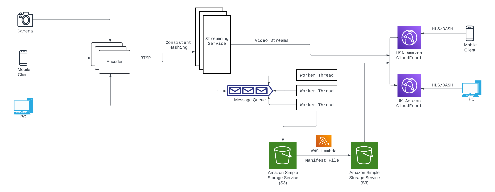

# Educational Streaming Platform

## Overview
The Scalable Educational Video Streaming Platform is a comprehensive solution designed to deliver high-quality video content to users globally. With a focus on scalability, efficiency, and adaptability, our system design ensures optimal performance and reliability while accommodating varying user demands and network conditions.

## Functional Requirements of the System
1. Stream live video to global audience. As the audience expands, the system is designed to scale horizontally to accommodate increasing user traffic and demand for video content. 
2. Our system should convert videos to different resolutions and codecs.
3. Minimizing latency is crucial for delivering a seamless streaming experience. 
4. Redundancy and fault tolerance should be implemented to minimize downtime and ensure high availability during system failures or disruptions.
5. Content is optimized for adaptive bitrate streaming, allowing users to receive the best possible video quality based on their device capabilities and network conditions.
6. The platform should be designed with a modular architecture, allowing for easy integration of new features and technologies.

## API Design
- StartStream(userId,name)
- EndStream(userId,name,streamID)
- WatchStream(streamID)

## Capacity Estimates
- 100 million total daily active users
- Up to 1 million concurrent viewers per stream
- Support a live stream of 1 hour with 4K resolution is 4GB, then for 720p be 2GB and 480p is 1GB
- Total storage for all resolutions and codecs is 7*3 = 21GB per live stream.

## System Components

### Video Sources
Cameras, mobiles capture video content, which is then transmitted to the encoding infrastructure for processing.

### Encoder
Responsible for converting the raw video feed captured by the camera into a digital format suitable for streaming over the internet.performs video compression and encoding to optimize the video data for efficient transmission and playback.

### Streaming Service
Encoded video streams are forwarded to the streaming service using RTMP (Real-Time Messaging Protocol) for further processing. It handles tasks such as ingest, transcoding, storage, delivery, and playback of the video stream.

### Queue and Worker Threads
The streaming service adds tasks, such as transcoding and storage, to a queue for asynchronous processing. This decouples the processing workload from incoming requests, enabling efficient resource utilization and scalability.

### Storage
storage is essential for storing, managing, and delivering educational video content in a scalable and reliable manner, ensuring seamless playback and user experience.

### Cloud Front (CDN): 
Transcoded video content is stored in scalable cloud storage (e.g., Amazon S3) and integrated with a CloudFront(CDN) for efficient content delivery. The CDN utilizes edge caching and intelligent routing to minimize latency and optimize content delivery to users worldwide.

## Technical Decisions
### RTMP (Real-Time Messaging Protocol): 
RTMP is chosen for its low-latency streaming capabilities, making it suitable for live video streaming applications. It's widely supported and efficient for real-time data transmission, which aligns well with the requirements of your system.
### HTTPS 
HTTPS is utilized for communication between components such as the streaming service, task queue, and CDN.

### HLS/DASH
These protocols were chosen for delivering video content to users due to their support for adaptive bitrate streaming. ABR allows the platform to dynamically adjust video bitrate and resolution based on network conditions, ensuring optimal viewing experience for users with varying internet speeds and device capabilities.

### Queueing Mechanism
A queueing system (Kafka, or AWS SQS) is employed to manage tasks asynchronously. This choice facilitates decoupling between components, enabling better scalability, fault tolerance, and efficient resource utilization. It ensures that tasks such as transcoding and storage are processed in an orderly and scalable manner.

### Storage Solution: Amazon S3 
Amazon S3 provides scalable, durable, and highly available object storage. It's a natural fit for storing large volumes of static video content efficiently. S3's reliability and scalability make it suitable for storing both original and transcoded versions of the video streams along with manifest file.

###  Manifest Generation:
AWS Lambda is chosen to generate the manifest file dynamically. Lambda functions are serverless and scale automatically, which is beneficial for handling intermittent workloads like manifest generation triggered by new video uploads. It eliminates the need for managing server infrastructure, leading to cost savings and operational simplicity.

### Consistent Hashing for Stream Distribution: 
Consistent hashing is employed to distribute video streams across multiple servers in a consistent and balanced manner. This technique ensures that each stream is assigned to a specific server based on a hash function, facilitating load balancing and fault tolerance in the streaming service.

### Redundancy and Fault tolerance
Encoders are designed for redundancy and load balancing to ensure high availability and efficient utilization of resources. Sharding is used to launch multiple Streaming Services. Fail over mechanism is implemented in them. Amazon S3 and CloudFront makes the system reliable to growing user requests.

