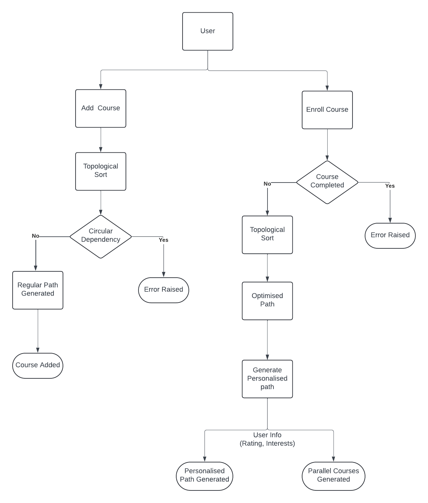

# Course Platform

## DEMO
Link : <a href="https://educational-course-platform-305a48361bd8.herokuapp.com/">Educational-Platform </a>

I have build a demo web application for this project using Flask for backend, React for frontend and hosted it on Heroku.
Github repository for this can be found at <a href="https://github.com/rajnayak369/Flask-Course-Platform">Flask-Course-Platform</a>

Note: Main purpose of this application is for testing. The application isn't optimised yet needs a lots of code improvements and refactoring.


## Overview
The Course Platform is a python based system designed to facilitate online learning to users by offering courses, generating personalized learning paths for seamless user Navigation while optimising course competition time, accommodating parallel course enrolment and managing circular dependencies. 

## Assumptions 
1.	Optimised Course completion time: I am considering this to be time taken by user to complete personalised course path generated for the user.
2.	Learning path navigation is the personalised path generated for the user based on his past course engagements, interests and performance.
3.	Independent course are courses which does not have any prerequisites or prerequisite already completed by the user.
4.	Parallel course enrolment: For this, I am considering user can enrol in any course. System won’t prevent user to enrol rather recommendations of independent course based on user level and interests.
5.	I am considering courses as node and dependencies as edges in my algorithm.
6.	For the sake of the example, I have chosen some courses and pre-existing dependencies in the system.

## Approach

<p align="center">
  
</p>

- The Course Platform project aims to provide a comprehensive solution for managing and facilitating course enrolment, leveraging Python's object-oriented programming (OOP) principles and various algorithms and data structures. Here's an overview of my approach to designing and implementing this project.

- When a course is added by user. A graph based topological sort algorithm is executed. If any circular dependency is detected a error is raised. If not found a regular path is generated and stored in regular path map where key is course name, value is regular path generated. Finally the course is added to the system.

- When a user initiates to enrol in a course. First we check if the user has already completed the course. If yes an error is raised. If not a graph based topological sort algorithm is executed to generated an optimised path using users course completed list. This path is further personalised using user details like past course engagements, interests and performance and along with that a recommended parallel enrol courses list is shown.


### Concepts used
1. Encapsulation: I've encapsulated course-related data within the Platform class, using private attributes and methods. This ensures data integrity and promotes a clear separation of concerns.
2. Data Structures: Efficient data structures like dictionaries, sets, and heaps are employed to store and manipulate course-related data, optimizing performance and memory usage.
3. Readability, Refactoring, and Code Redundancy: Throughout the development process, DRY is consistently applied to avoid unnecessary duplication of code and promote a more maintainable and efficient codebase. Thus, reducing redundancy and promoting code reusability.
4. Error Handling: Exception handling mechanisms are implemented to gracefully handle errors, enhancing the robustness and reliability of the code.


## Classes
1. Courses: A Course class stores course details like name, level, duration and prerequisites. Set data structure is used to define prerequisites to eliminate duplicates and  for efficient membership checks (O(1)). This allows for quick verification of whether a course has a specific prerequisite completed.
2. User: A User class stores user information like name, performance, completed courses, interested courses using sets for completed and interested courses. Sets enable efficient lookups (O(1)) to determine if a user has completed a specific course or expressed interest in a particular area.
3. Platform: A Platform class manages courses and dependencies. It utilizes a dictionary (self.courses) to store courses by name for easy retrieval, (self.regular_path) dictionary is used to store a course regular path irrespective of user details and another dictionary (self.prerequisite_map) to represent course dependencies as a graph. In this graph, keys(node) represent courses, and values(edges) are lists containing their prerequisite courses. This structure facilitates efficient navigation through the course dependency hierarchy.

## Course Dependency Resolution:
Course dependency resolution happens in two main scenarios: adding a new course and enrolling a user in a course. Here's a breakdown of how I have implemented it in my code:

### Add Course
   - #### Prerequisite Validation:
Check if all prerequisites listed for the new course exist within the platform's course offerings.
Raise an error if any prerequisite course is missing.
   - #### Circular Dependency Check:
After verifying prerequisites, I use the the _can_enroll_helper method to check for circular dependencies using graph-based data structure, where courses are nodes and prerequisites are edges. This method implements a depth-first search (DFS) algorithm to traverse the prerequisite graph and detect cycles. If a cycle is found, a ValueError is raised and the course addition is aborted.  .

### Enroll Course
   - #### Course Completion Check:
When enrolling a user in a course, I perform a check using the _can_enroll_helper method. This check helps to verify if that the course is completed by user or not. If completed, I'm raising a ValueError and preventing the course to be enrolled.

## Personalized path
It is achieved in two steps
For example lets consider to find the personalised path for Django Course.
- Course_name (Dificulty) (Duration) -> {list of prerequisites}
1. HTML (1) (5)
2. CSS (2) (6)
3. JavaScript (3) (8) -> {HTML,CSS}
4. python (2) (7)
5. React (4) (10) -> {JavaScript}
6. English (2) (5)
7. Flask (4) (8) -> {Python, JavaScript}
8. Django (5) (10) -> {python, JavaScript}
9. Java (3) (7)
10. French (4) (8)


### Optimized Path Using Topological Sort:
1. In this step, the algorithm leverages a topological sort to generate an optimized learning path based on the prerequisites of courses and the user's completed courses.
2. The visited and processed sets are utilized to track the courses that have been visited and processed during the topological sort. The purpose of maintaining the processed set is to avoid redundant processing of courses. Once a course and its prerequisites have been processed, they do not need to be revisited in subsequent recursive calls and efficiently handling circular dependencies.
   - Result order will be: HTML-> CSS-> JavaScript-> Python-> Django
3. Now I will used the completed courses list to futher optimse the path
   - Completed = {CSS}
   - optimised path : HTML-> JavaScript-> Python-> Django
### Personalized Path Using User Details
After generating the optimized learning path, the algorithm further personalizes this path based on the user's specific interests and performance rating.
1. I identified independent courses that can be completed in parallel for this course path.The user's area of interest then guides the prioritization of these independent courses, ensuring that courses relevant to the user's interests are given higher priority.
    - Independent courses found in this path which can be taken in parallel are 
      - Independent = { HTML, Python}
    - let area of interests be - { HTML, Python, React, English} and these should be prioritised
    - The related courses found in out path are - { HTML, Python}
    - updated path : HTML-> Python-> JavaScript-> Django
2. Additionally, the performance rating may influence the order in which interested courses are recommended. For example, if the user has a higher performance rating, more advanced courses may be recommended earlier in the path.
    - Let's assume on scale of 1-5 . user_rating >= 4 is considered Higher and rest are Lower rating
    - our user rating is : 4 (higher) so advanced courses are given importance
    - Interested courses found in our path are HTML(1), Python(2). Python is of higher difficulty so it is prioritised.
    - updated path : Python-> HTML-> JavaScript-> Django

Overall, this two-step approach ensures that the generated learning paths are not only optimized in terms of prerequisite fulfillment but also personalized to meet the unique needs and preferences of each user.
   - Initial path and duration HTML-> CSS-> JavaScript-> Python-> Django (36 hrs)
   - Final optimised personal path and duration Python-> HTML-> JavaScript-> Django (30 hrs)

## Parallel Course Enrollment:
Recommendation for parallel course enrollment is generated in two ways.

### Parallel courses to choose from path of enrolled course:
1. In the above example when we personalized path using user details we came across a list of Independent courses found in the path which can be taken in parallel. This given as first line recommendations. parallel learning of the Independent courses which are in the course path helps us to finish the enrolled course faster.
   - Recommended parallel courses will be : { HTML, Python}
### More Independent courses to choose:
Using get_personalized_enrollable_courses method, personalized recommendations for enrolling in courses are provided based on the user's completed courses and area of interests. 
1. The method iterates through a list of potential courses to consider.
2. It checks if a course has no outstanding prerequisites and has not been completed by the user. If these conditions are met, the course is marked as enrollable.
3. If a course has prerequisites, it determines if all of its prerequisites have been completed. If so, the course is marked as enrollable.
4. Courses aligned with the user's area of interests are prioritized and shown first in the list
5. Independent Courses from all available courses are
   - { HTML, CSS, Python, English, Java, French} 
   - updated : { HTML, Python, Java, English, French} // CSS is finished by our user
   - update: { HTML, Python, English, Java, French} // area of interests { HTML, Python, React, English} React is not considered as it is not independent. User still need to finish JavaScript.
### Final two lists are:
   - { HTML, Python} // Recommended as related to enrolled course path
   - { HTML, Python, English, Java, French} // based on user interests


## Requirements
All the packages and libraries required for this application to run can be found in requirements.txt file.


## Building the application
You need to clone/download the application  

```bash
git clone "repo_link"
```
Run the below command to install pyenv

```bash
pyenv update
pyenv install 3.10.7 # to install the pyenv on your server.
```

You need to create a virtual environment. Set present location in termial to root directory of the project and then run the following commands to create and start the virtunal environment.  
```bash
pyenv local 3.10.7 # this sets the local version of python to 3.10.7
python3 -m venv .venv # this creates the virtual environment for you
source .venv/bin/activate # this activates the virtual environment
pip install --upgrade pip [ this is optional]  # this installs pip, and upgrades it if required.
```

To install the dependencies run the following command.
```bash
pip install -r requirements.txt
```

  
## Running the application
To use the Course Platform, follow these guidelines or check main.py file in src folder:

1. Initialize a Platform object.
2. Add courses to the platform using the `add_course` method.
3. Create a User object and specify completed courses and areas of interest.
4. Enroll the user in a course using the `course_enroll` method.
5. Get enrollable courses for the user using the `get_personalized_enrollable_courses` method.
```bash
cd src
python3 main.py
```
  

